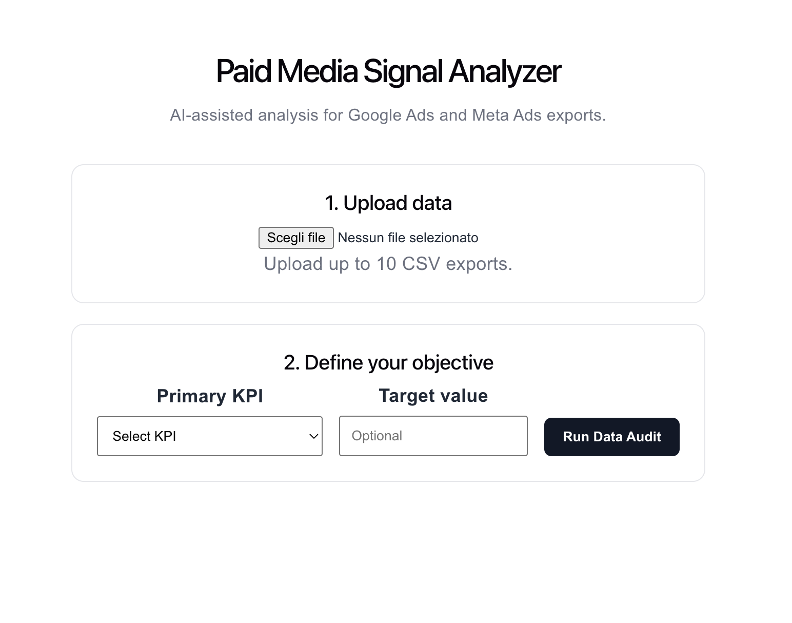
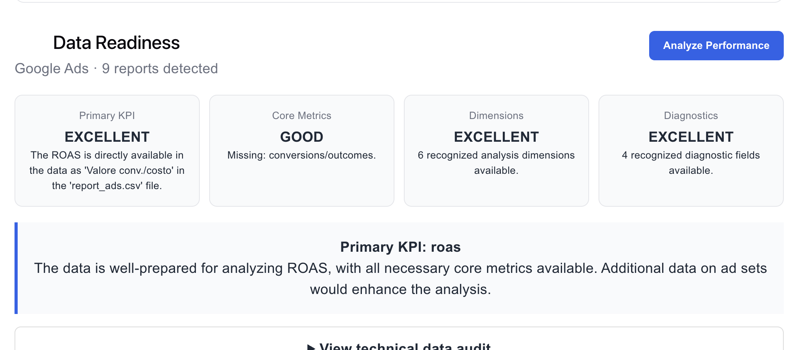
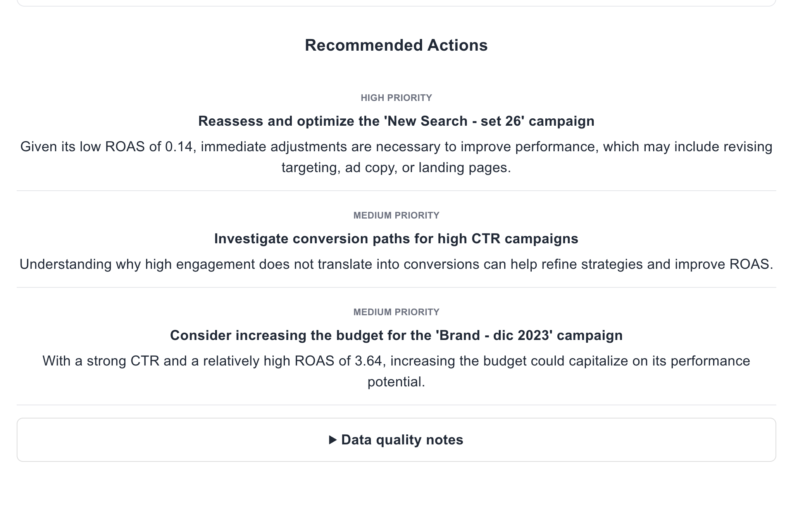

# Paid Media Signal Analyzer

An AI-assisted analysis tool for paid media exports from **Google Ads** and **Meta Ads**.

The application ingests raw CSV exports, normalizes heterogeneous and localized field names, audits the available data, calculates performance metrics and benchmarks, and turns them into structured performance signals and AI-assisted insights.

The core design principle is simple:

> **Use deterministic code for facts and calculations. Use AI for interpretation.**

---

## What it does

Paid Media Signal Analyzer helps turn fragmented advertising exports into a consistent analytical layer.

The workflow is divided into two main stages:

### 1. Data Audit

Uploaded CSV files are inspected before any performance analysis is attempted.

The system:

* detects Google Ads and Meta Ads exports
* handles localized field names
* normalizes equivalent metrics across platforms
* parses localized numeric formats
* removes aggregate rows such as `Totale:`
* classifies fields using a deterministic taxonomy
* detects available dimensions, diagnostics, funnel metrics, settings and outcomes
* identifies missing data
* evaluates which analyses are realistically possible from the uploaded dataset

The goal is to avoid producing conclusions that the available data cannot support.

### 2. Performance Analysis

Once the dataset has been validated, the application:

* calculates derived KPIs
* builds account-level benchmarks
* compares campaign performance against those benchmarks
* detects relevant performance signals
* sends the structured analytical context to OpenAI
* generates a concise interpretation of the most relevant findings

Typical calculated metrics include:

* CTR
* CPC
* CPM
* CVR
* CPA
* ROAS
* Frequency

Benchmarks are calculated from the uploaded account data rather than relying on generic industry averages.


## Screenshots

### Data ingestion and objective setup



### Data readiness



### AI performance analysis




---

## Why I built it

Paid media analysis often starts from exports that were not designed to work together.

Google Ads and Meta Ads use:

* different naming conventions
* different campaign structures
* different outcome definitions
* localized column names
* partially overlapping metrics
* exports containing totals, settings and diagnostic fields mixed with actual performance data

Sending those files directly to an LLM creates a major reliability problem: the model is forced to simultaneously understand the schema, normalize the data, perform calculations and interpret the result.

Paid Media Signal Analyzer separates these responsibilities.

```text
Raw CSV exports
      ↓
Parsing & cleaning
      ↓
Deterministic field taxonomy
      ↓
Metric normalization
      ↓
Data Audit
      ↓
KPI calculation & account benchmarks
      ↓
Performance signal detection
      ↓
AI interpretation
      ↓
Analyst-friendly output
```

---

## Hybrid deterministic + AI architecture

A deliberate architectural choice was to avoid using the LLM as the source of truth for the dataset.

### Deterministic layer

Code is responsible for:

* CSV parsing
* localized number parsing
* field classification
* metric normalization
* row filtering
* KPI calculation
* account benchmarks
* availability of dimensions and diagnostics
* identification of funnel, setting and outcome fields

These outputs remain authoritative.

### AI layer

OpenAI is used for tasks where semantic reasoning adds value:

* understanding the analytical potential of the dataset
* explaining limitations
* interpreting performance signals
* prioritizing meaningful observations
* producing concise analyst-style summaries

This reduces hallucination risk and keeps numerical reasoning grounded in values already calculated by the application.

---

## Field taxonomy

Instead of treating every CSV column as an independent metric, uploaded fields are mapped into semantic categories.

Examples include:

```text
metric
dimension
funnel_metric
diagnostic
setting
outcome
```

Equivalent fields can therefore resolve to the same canonical concept.

For example:

```text
"Importo speso"
"Costo"
"Spend"

→ spend
```

and:

```text
"Clic"
"Clicks"

→ clicks
```

This allows exports from different advertising platforms and languages to be analyzed through the same internal model.

---

## Localized data handling

Advertising exports frequently contain locale-dependent numeric values.

Examples:

```text
1.234,56
1,234.56
23,4%
€ 1.250,00
```

The analyzer normalizes these representations before calculations are performed.

Aggregate export rows such as:

```text
Totale:
```

are excluded so that platform-generated totals are not accidentally interpreted as campaigns or duplicated inside account calculations.

---

## Performance signals

The application does not simply send campaign tables to an LLM.

Campaign metrics are first compared with account-level benchmarks.

Examples of signals include:

```text
strong ROAS
efficient CPA
high conversion volume
high CTR
weak CVR
```

This creates a structured analytical layer between raw advertising data and natural-language interpretation.

The result is closer to an analyst workflow:

```text
data → metrics → benchmark → signal → interpretation
```

rather than:

```text
data → prompt → opinion
```

---

## API

The backend exposes two main analytical endpoints.

### Data Audit

```http
POST /api/audit
```

Receives the uploaded datasets together with the selected primary KPI and optional target value.

The endpoint returns the normalized dataset profile and an assessment of the analyses that can be performed.

### Performance Analysis

```http
POST /api/analyze
```

Calculates campaign metrics, account benchmarks and performance signals before generating the AI-assisted analysis.

A health endpoint is also available:

```http
GET /api/health
```

---

## Tech stack

### Frontend

* React
* JavaScript
* CSS

### Backend

* Node.js
* Express
* OpenAI API

### Data processing

* CSV parsing
* deterministic normalization layer
* localized numeric parser
* canonical field taxonomy
* account-level KPI benchmarking

---

## Interface

The dashboard is intentionally designed as an analytical tool rather than a generic chatbot.

The interface separates:

* uploaded data
* Data Audit
* available metrics and dimensions
* dataset limitations
* performance analysis
* AI-generated insights

Secondary technical information is grouped into accordions to keep the main analytical output readable.

### Screenshots

<!-- Replace these paths with the final screenshots -->

```markdown


```

---

## Running locally

Clone the repository:

```bash
git clone <repository-url>
cd <repository-folder>
```

Install dependencies:

```bash
npm install
```

Create the environment configuration:

```bash
OPENAI_API_KEY=your_openai_api_key
```

Start the application according to the frontend/backend scripts defined in the project.

The API runs locally on:

```text
http://localhost:3001
```

---

## Current scope

The project currently focuses on:

* Google Ads exports
* Meta Ads exports
* campaign-level paid media analysis
* cross-platform field normalization
* dataset readiness assessment
* KPI benchmarking
* performance signal extraction

It is designed as an analytical prototype rather than a replacement for the advertising platforms themselves.

---

## Possible next steps

Potential extensions include:

* automatic recognition of additional advertising platforms
* deeper search-term and keyword analysis
* creative-level analysis
* time-series anomaly detection
* configurable KPI targets
* comparison between different reporting periods
* persistent analysis sessions
* direct API integrations instead of CSV exports

---

## Project focus

This project explores a practical pattern for AI-assisted analytics:

**LLMs should interpret structured evidence, not replace the deterministic systems that produce it.**

The objective is therefore not simply to generate an AI summary of advertising data, but to create a reliable intermediate analytical layer that makes those summaries more grounded, reproducible and useful.
